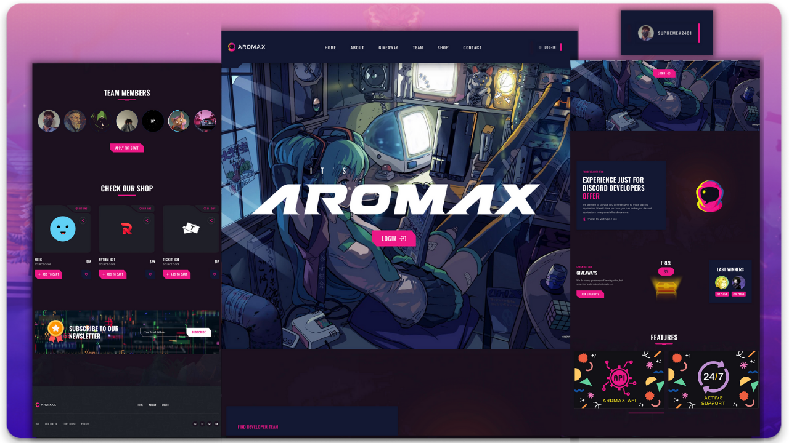

<div align="center">
  
  
  

  <h2 align="center">Discord-Server-Dashboard</h2>

  It is a fully responsive discord server/bot dashboard template. Here you can see login system also. 


</div>

<br>

## Installation

- Clone Repo
```
git clone https://github.com/diwasatreya/Discord-Server-Dashboard.git
```

- [Run in replit](https://repl.it/github/diwasatreya/Discord-Server-Dashboard)

- After cloning, type (Shell/Terminal)
```js
npm install
```

- Create `.env` file (Environment Secret in replit)
```
TOKEN=XXXXXXXXXX
DB=XXXXXXXXXXXXX
```

- Fill `config.json` 


## Discord Developer Portal
Add `https://domain/` & `https://domain/auth/login` in application OAuth2 redirect url 


## Adding API's
Goto `routes/api.js` then add your api code

<div align="center">
  <br>
  <h3> Star the Project </h3>
  <p> Follow me on github </p>
 
 </div>
            
